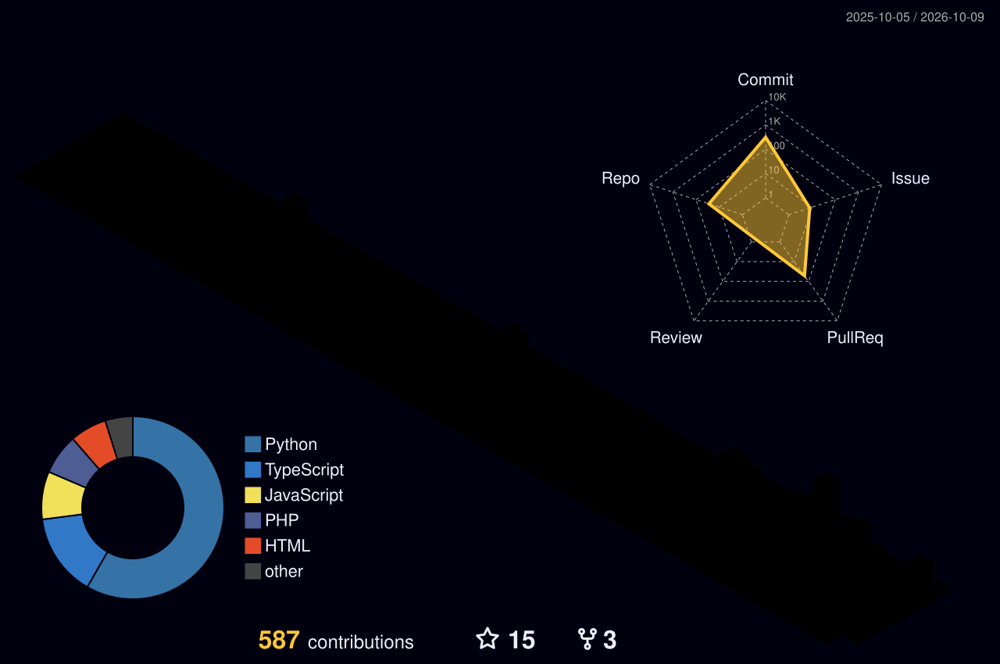

  

 

### Overview
Informatics student at STIKOM Poltek Cirebon working on machine learning, backend engineering, and LLM integrations.

> "The fake is of far greater value. In its deliberate attempt to be real, it possesses more reality than the actual thing." — Kaiki Deishuu

---

### Featured Projects

<table>
  <tr>
    <td width="50%" valign="top">
      <a href="https://github.com/DarRahman/PasarCirebon"><b>PasarCirebon</b></a>
       
      Regional food commodity price forecasting system and analytics dashboard for Cirebon markets.
        
      <code>Python</code> <code>XGBoost</code> <code>Time-Series</code>
    </td>
    <td width="50%" valign="top">
      <a href="https://github.com/DarRahman/hermes-discord-presence"><b>hermes-discord-presence</b></a>
       
      Discord Rich Presence plugin for Hermes Agent with real-time session and token tracking.
        
      <code>Python</code> <code>Discord IPC</code>
    </td>
  </tr>
  <tr>
    <td width="50%" valign="top">
      <a href="https://github.com/dragonsterm/EasyLedger"><b>EasyLedger</b></a>
       
      Voice-driven sales ledger and lightweight dashboard builder for merchants (AssemblyAI Hackathon).
        
      <code>AssemblyAI</code> <code>Fastify</code> <code>Voice Agent</code>
    </td>
    <td width="50%" valign="top">
      <a href="https://github.com/dragonsterm/PlantNeeds"><b>PlantNeeds</b></a>
       
      Automated plant care telemetry and monitoring system with sensor failover and FloraDB.
        
      <code>Python</code> <code>FloraDB</code> <code>IoT Telemetry</code>
    </td>
  </tr>
</table>

---

### Technologies and Tools

   &nbsp;
   &nbsp;
   &nbsp;
   &nbsp;
   &nbsp;
  

  

---

### Contribution Graph (3D)

  

---

### Activity and Metrics

  
  &nbsp;
  

  

